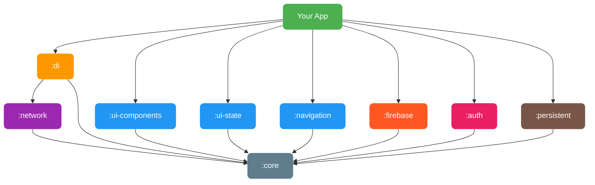
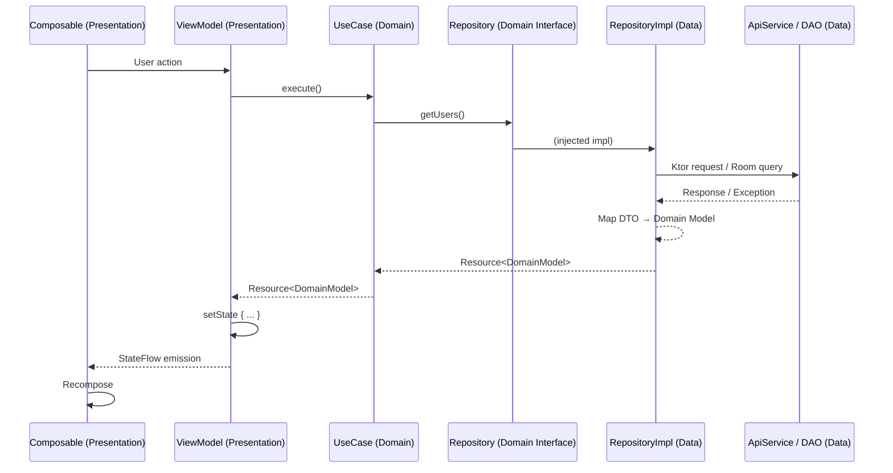

# Miru SDK

**Kotlin Multiplatform SDK for accelerating mobile development.**

Miru SDK provides a modular, configurable foundation for building Android and iOS apps with shared business logic and UI components. Designed as an internal base project for software houses, it handles networking, state management, navigation, theming, and dependency injection out of the box — so your team can focus on features, not boilerplate.

Each module follows **Clean Architecture** principles with clear separation into **data**, **domain**, and **presentation** layers, ensuring testability, maintainability, and independence between layers.

[](https://jitpack.io/#wahidabd/miru-sdk)

---

## Features

- **Multiplatform** — Single codebase targeting Android and iOS
- **Clean Architecture** — Each module follows data/domain/presentation layer separation
- **Modular** — Pick only the modules you need
- **Type-Safe Networking** — Ktor-based HTTP client with automatic error mapping
- **State Management** — BaseViewModel + UiState pattern with one-time event support
- **Navigation** — Compose Navigation wrapper with safe navigation, transitions, and result passing
- **UI Components** — Ready-to-use Material 3 composables with full theming
- **Dependency Injection** — Koin-powered DI with Compose integration
- **Firebase** — Remote Config + FCM topic management with KMP support
- **Social Auth** — Google, Apple, Facebook OAuth with pre-built sign-in buttons
- **Persistent** — Room KMP local database + DataStore preferences with convenient wrappers
- **Configurable** — Override themes, API configs, and inject custom modules per project

---

## Architecture

### Clean Architecture Per Module

Each module in Miru SDK is internally structured following Clean Architecture with three layers:

```
┌──────────────────────────────────────────────┐
│              Presentation Layer               │
│  (UI Composables, ViewModels, UiState)        │
│                     │                         │
│                     ▼                         │
│               Domain Layer                    │
│  (Use Cases, Repository Interfaces, Models)   │
│                     │                         │
│                     ▼                         │
│                Data Layer                     │
│  (Repository Impl, API, DAO, DataSource)      │
└──────────────────────────────────────────────┘
```

**Domain** is the innermost layer with zero dependencies — it defines interfaces (repository contracts) and business models. **Data** implements those interfaces with concrete data sources (API, Room, DataStore). **Presentation** consumes domain use cases/repositories and exposes UI state.

The dependency rule flows **inward only**: `presentation → domain ← data`. The data layer depends on domain (to implement interfaces), but domain never depends on data or presentation.

### Module Dependency Graph



### Internal Module Layer Structure

Each feature module follows this pattern internally:

```
:feature-module/
└── src/commonMain/kotlin/
    └── com/miru/sdk/feature/
        ├── data/                  # Data Layer
        │   ├── repository/        #   Repository implementations
        │   ├── source/            #   Remote/Local data sources
        │   ├── model/             #   DTOs, entities, API models
        │   └── mapper/            #   Data ↔ Domain mappers
        ├── domain/                # Domain Layer
        │   ├── repository/        #   Repository interfaces (contracts)
        │   ├── model/             #   Business/domain models
        │   └── usecase/           #   Use cases (business logic)
        └── presentation/          # Presentation Layer (if applicable)
            ├── ui/                #   Composable screens/components
            └── viewmodel/         #   ViewModels + UiState
```

> Not all modules have all three layers. Foundation modules like `:core` and `:network` primarily provide domain and data layer abstractions. UI-only modules like `:ui-components` are purely presentation.

### Data Flow (Clean Architecture)



---

## Modules

| Module | Description |
|---|---|
| **`:core`** | Base utilities — `Resource<T>`, `AppException`, `Mapper`, extensions, logging |
| **`:network`** | HTTP client — `ApiService`, `safeApiCall`, token management, error handling |
| **`:ui-state`** | State management — `BaseViewModel`, `UiState`, `MutableEventFlow`, pagination |
| **`:navigation`** | Navigation — `NavigationManager`, safe navigation, transitions, result passing |
| **`:ui-components`** | UI library — Buttons, TextFields, Dialogs, TopBar, BottomSheet, Theming |
| **`:firebase`** | Firebase KMP — Remote Config, FCM topic subscribe/unsubscribe, TopicManager |
| **`:auth`** | Social Auth — Google, Apple, Facebook OAuth with pre-built Compose sign-in buttons |
| **`:persistent`** | Local storage — Room KMP database + DataStore preferences with convenient wrappers |
| **`:di`** | DI & init — `MiruSdkInitializer`, Koin modules, Compose injection helpers |

---

## Tech Stack

| Technology | Version | Purpose |
|---|---|---|
| Kotlin | 2.3.0 | Language |
| Compose Multiplatform | 1.10.0 | Shared UI |
| Ktor | 3.4.1 | HTTP Client |
| Koin | 4.0.3 | Dependency Injection |
| Kotlinx Serialization | 1.7.3 | JSON parsing |
| Kotlinx Coroutines | 1.9.0 | Async programming |
| Firebase KMP (GitLive) | 2.1.0 | Remote Config, FCM |
| KMPAuth | 2.5.0-alpha01 | Google, Apple, Facebook OAuth |
| Room KMP | 2.8.4 | Local database |
| DataStore KMP | 1.2.1 | Preferences storage |
| Coil | 3.0.4 | Image loading |
| Napier | 2.7.1 | Multiplatform logging |
| AGP | 9.0.0 | Android build |

---

## Installation

Add JitPack repository to your `settings.gradle.kts`:

```kotlin
dependencyResolutionManagement {
    repositories {
        google()
        mavenCentral()
        maven("https://jitpack.io")
    }
}
```

Add dependencies in your module's `build.gradle.kts`:

```kotlin
dependencies {
    // All modules
    implementation("com.github.wahidabd.miru-sdk:core:<version>")
    implementation("com.github.wahidabd.miru-sdk:network:<version>")
    implementation("com.github.wahidabd.miru-sdk:ui-state:<version>")
    implementation("com.github.wahidabd.miru-sdk:navigation:<version>")
    implementation("com.github.wahidabd.miru-sdk:ui-components:<version>")
    implementation("com.github.wahidabd.miru-sdk:firebase:<version>")
    implementation("com.github.wahidabd.miru-sdk:auth:<version>")
    implementation("com.github.wahidabd.miru-sdk:di:<version>")
}
```

> Replace `<version>` with the latest release tag.

---

## Quick Start

### 1. Initialize the SDK

```kotlin
// Application.kt or shared entry point
MiruSdkInitializer.initialize(
    MiruSdkConfig(
        networkConfig = NetworkConfig(
            baseUrl = "https://api.yourapp.com/v1/",
            enableLogging = BuildConfig.DEBUG
        ),
        enableLogging = true,
        tokenProvider = MyTokenProvider(),     // optional
        additionalModules = listOf(appModule) // your Koin modules
    )
)
```

### 2. Define Domain Layer (models, repository interface, use case)

```kotlin
// domain/model/User.kt — pure business model
data class User(
    val id: Int,
    val name: String,
    val email: String
)

// domain/repository/UserRepository.kt — contract (interface only)
interface UserRepository {
    suspend fun getUsers(): Resource<List<User>>
    suspend fun getUserById(id: Int): Resource<User>
}

// domain/usecase/GetUsersUseCase.kt — single-responsibility business logic
class GetUsersUseCase(private val repository: UserRepository) {
    suspend operator fun invoke(): Resource<List<User>> = repository.getUsers()
}
```

### 3. Implement Data Layer (API, DTO, mapper, repository impl)

```kotlin
// data/model/UserDto.kt — API response model (DTO)
@Serializable
data class UserDto(
    val id: Int,
    val name: String,
    val email: String
)

// data/mapper/UserMapper.kt — DTO → Domain model
class UserMapper : Mapper<UserDto, User> {
    override fun map(from: UserDto) = User(
        id = from.id,
        name = from.name,
        email = from.email
    )
}

// data/source/UserApi.kt — remote data source
class UserApi(httpClient: HttpClient) : ApiService(httpClient) {
    suspend fun getUsers(): Resource<ApiResponse<List<UserDto>>> =
        get("users")
    suspend fun getUserById(id: Int): Resource<ApiResponse<UserDto>> =
        get("users/$id")
}

// data/repository/UserRepositoryImpl.kt — implements domain interface
class UserRepositoryImpl(
    private val api: UserApi,
    private val mapper: UserMapper
) : UserRepository {

    override suspend fun getUsers(): Resource<List<User>> =
        api.getUsers().map { response ->
            response.data?.map { mapper.map(it) } ?: emptyList()
        }

    override suspend fun getUserById(id: Int): Resource<User> =
        api.getUserById(id).map { response ->
            mapper.map(response.data!!)
        }
}
```

### 4. Create Presentation Layer (ViewModel + UI)

```kotlin
// presentation/viewmodel/UserListViewModel.kt
data class UserListState(
    val users: List<User> = emptyList(),
    val isLoading: Boolean = false,
    val error: String? = null
)

sealed interface UserListEvent {
    data class ShowError(val message: String) : UserListEvent
}

class UserListViewModel(
    private val getUsersUseCase: GetUsersUseCase
) : BaseViewModel<UserListState, UserListEvent>(UserListState()) {

    fun loadUsers() = launch {
        setState { copy(isLoading = true, error = null) }

        getUsersUseCase()
            .onSuccess { users ->
                setState { copy(users = users, isLoading = false) }
            }
            .onError { exception, _ ->
                setState { copy(isLoading = false, error = exception.message) }
                sendEvent(UserListEvent.ShowError(exception.message ?: "Unknown error"))
            }
    }
}

// presentation/ui/UserListScreen.kt
@Composable
fun UserListScreen(viewModel: UserListViewModel = koinViewModel()) {
    val state by viewModel.uiState.collectAsStateLifecycleAware()

    viewModel.events.collectAsEffect { event ->
        when (event) {
            is UserListEvent.ShowError -> { /* show snackbar */ }
        }
    }

    MiruTheme {
        when {
            state.isLoading -> MiruFullScreenLoading()
            state.error != null -> MiruErrorView(
                message = state.error!!,
                onRetry = { viewModel.loadUsers() }
            )
            else -> LazyColumn {
                items(state.users) { user ->
                    MiruCard {
                        Text(user.name, style = MiruTheme.typography.titleMedium)
                    }
                }
            }
        }
    }
}
```

### 5. Wire Dependencies (Koin Module)

```kotlin
// di/UserModule.kt — bind all layers via Koin
val userModule = module {
    // Data
    single { UserMapper() }
    single { UserApi(get()) }
    single<UserRepository> { UserRepositoryImpl(get(), get()) }

    // Domain
    factory { GetUsersUseCase(get()) }

    // Presentation
    viewModel { UserListViewModel(get()) }
}
```

### 6. Set Up Navigation

```kotlin
@Composable
fun AppNavigation() {
    val navigationManager = remember { NavigationManagerImpl() }

    MiruNavigationHost(startDestination = "home") {
        composable("home") { HomeScreen() }
        composable("users") { UserListScreen() }
        composable("user/{id}") { backStackEntry ->
            val id = backStackEntry.getIntArgument("id")
            UserDetailScreen(userId = id)
        }
    }
}
```

---

## Module Details

### Core

The foundation layer with zero UI dependencies.

**Resource** wraps all async operations:

```kotlin
val result: Resource<User> = userApi.getUserById(1)

result
    .onSuccess { user -> println(user.name) }
    .onError { exception, _ -> println(exception.message) }
    .onLoading { println("Loading...") }
```

**AppException** provides typed error handling:

```kotlin
when (exception) {
    is AppException.UnauthorizedException -> navigateToLogin()
    is AppException.NetworkException -> showOfflineMessage()
    is AppException.ServerException -> showServerError(exception.code)
    is AppException.TimeoutException -> showRetryDialog()
    else -> showGenericError()
}
```

**Extensions** for common operations:

```kotlin
// String
"hello world".capitalizeFirst()   // "Hello world"
"test@email.com".isValidEmail()   // true

// Flow
flow.throttleFirst(300L)
flow.retryWithExponentialBackoff(maxRetries = 3)
flow.asResource() // Flow<T> -> Flow<Resource<T>>

// Collections
list.safeGet(99)                    // null instead of crash
list.updateIf({ it.id == 5 }) { it.copy(name = "Updated") }
```

### Network

The network module provides **data layer** abstractions for HTTP communication.

**Domain layer** — `TokenProvider` interface (repository contract for auth tokens):

```kotlin
class MyTokenProvider : TokenProvider {
    override suspend fun getAccessToken(): String? = prefs.getString("access_token")
    override suspend fun getRefreshToken(): String? = prefs.getString("refresh_token")
    override suspend fun saveTokens(accessToken: String, refreshToken: String) { /* save */ }
    override suspend fun clearTokens() { /* clear */ }
    override suspend fun isLoggedIn(): Boolean = getAccessToken() != null
}
```

**Data layer** — `ApiService` as base remote data source, `safeApiCall` for error mapping:

```kotlin
// Your API extends ApiService (data/source layer)
class ProductApi(httpClient: HttpClient) : ApiService(httpClient) {
    suspend fun getProducts(): Resource<ApiResponse<List<ProductDto>>> = get("products")
}
```

**Token events** — observe globally for auth state changes:

```kotlin
TokenEventBus.events.collect { event ->
    when (event) {
        TokenEvent.ForceLogout -> navigateToLogin()
        TokenEvent.TokenExpired -> refreshToken()
        TokenEvent.TokenRefreshed -> retryRequest()
    }
}
```

### UI State

The ui-state module provides **presentation layer** base classes.

**BaseViewModel** — your ViewModels consume domain use cases, not data sources directly:

```kotlin
class ProductViewModel(
    private val getProductsUseCase: GetProductsUseCase  // domain layer
) : BaseViewModel<ProductState, ProductEvent>(ProductState()) {

    fun loadProducts() = launch {
        getProductsUseCase()
            .onLoading { setState { copy(isLoading = true) } }
            .onSuccess { data -> setState { copy(products = data, isLoading = false) } }
            .onError { e -> setState { copy(error = e.message, isLoading = false) } }
    }
}
```

**PagingState** for list pagination:

```kotlin
data class FeedState(
    val paging: PagingState<Post> = PagingState()  // Post = domain model
)

// Append new page
setState { copy(paging = paging.appendItems(newPosts)) }

// Refresh
setState { copy(paging = paging.refresh(freshPosts)) }
```

### UI Components

**Theming** — customize per project:

```kotlin
MiruTheme(
    colorScheme = MiruColorScheme(
        primary = Color(0xFF1E88E5),
        secondary = Color(0xFFFF6F00),
        // ... your brand colors
    ),
    typography = MiruTypography(
        titleLarge = TextStyle(fontSize = 22.sp, fontWeight = FontWeight.Bold),
        // ... your typography
    )
) {
    // All Miru components inherit these values
    MiruButton(text = "Submit", onClick = { })
}
```

**Available components:**

```
MiruButton          MiruTextField       MiruPasswordField
MiruSearchField     MiruTopBar          MiruSearchTopBar
MiruBottomSheet     MiruCard            MiruInfoCard
MiruAlertDialog     MiruLoadingDialog   MiruConfirmationDialog
MiruErrorView       MiruEmptyView       MiruFullScreenLoading
MiruLoadingIndicator MiruShimmerEffect  MiruNetworkImage
MiruSpacer          MiruVerticalSpacer  MiruHorizontalSpacer
```

### Firebase

**Remote Config** — fetch and read config values:

```kotlin
val config: MiruRemoteConfig = get() // via Koin

// Set defaults before fetching
config.setDefaults(mapOf(
    "feature_new_ui" to false,
    "api_base_url" to "https://api.yourapp.com",
    "max_retry" to 3L
))

// Fetch & activate
config.fetchAndActivate().collect { resource ->
    resource.onSuccess { activated -> println("Config activated: $activated") }
}

// Read values
val featureEnabled = config.getBoolean("feature_new_ui")
val apiUrl = config.getString("api_base_url")
val maxRetry = config.getLong("max_retry")
```

**FCM Topic Management** — subscribe/unsubscribe with reactive state tracking:

```kotlin
val topicManager: TopicManager = get() // via Koin

// Subscribe to topics
topicManager.subscribe("promo")
topicManager.subscribeAll(listOf("news", "updates", "alerts"))

// Observe active subscriptions reactively
topicManager.subscribedTopics.collect { topics ->
    println("Subscribed to: $topics")
}

// Check & unsubscribe
if (topicManager.isSubscribed("promo")) {
    topicManager.unsubscribe("promo")
}
```

**Koin setup:**

```kotlin
startKoin {
    modules(
        firebaseModule, // provides MiruRemoteConfig, MiruMessaging, TopicManager
        // ... other modules
    )
}
```

### Auth

**Google Sign-In** — standalone One Tap, dapet `idToken` langsung (no Firebase):

```kotlin
// 1. Initialize once at app startup
MiruGoogleAuth.initialize(serverClientId = "YOUR_SERVER_CLIENT_ID")

// 2. Pre-built Compose button
MiruGoogleSignInButton { resource ->
    resource.onSuccess { auth ->
        // Send idToken to your backend API
        api.loginWithGoogle(auth.idToken!!)
    }
}
```

**Apple Sign-In** — native iOS only, returns `identityToken`:

```kotlin
val appleAuth: MiruAppleAuth = get()

if (appleAuth.isAvailable()) {
    val result = appleAuth.signIn() // shows native Apple popup
    result?.let { auth ->
        // auth.idToken = Apple identityToken
        // auth.email, auth.displayName
        api.loginWithApple(auth.idToken!!)
    }
}
```

**Facebook Login** — native SDK, returns `accessToken`:

```kotlin
// Android: set ActivityResultRegistryOwner before sign-in (in your Activity's onCreate)
MiruFacebookAuth.setActivityResultRegistryOwner(this)

val facebookAuth: MiruFacebookAuth = get()

val result = facebookAuth.signIn() // shows Facebook login popup
result?.let { auth ->
    // auth.accessToken = Facebook access token
    // auth.email, auth.displayName, auth.photoUrl
    api.loginWithFacebook(auth.accessToken!!)
}

// Android: clear in onDestroy to prevent leaks
MiruFacebookAuth.clearActivityResultRegistryOwner()
```

**MiruAuthManager** — centralized auth state (provider-agnostic):

```kotlin
val authManager: MiruAuthManager = get()

// Observe auth state reactively
authManager.currentUser.collect { user ->
    if (user != null) navigateToHome()
    else navigateToLogin()
}

// Handle any sign-in result
MiruGoogleSignInButton { resource ->
    authManager.handleSignInResult(resource)
}

// Sign out
authManager.signOut()
```

| Provider | Platform | Implementation |
|---|---|---|
| Google | Android + iOS | KMPAuth standalone (commonMain) |
| Apple | iOS only | Native ASAuthorization (iosMain) |
| Facebook | Android + iOS | Facebook SDK (expect/actual) |

---

### Persistent

The `:persistent` module provides local storage through **Room KMP** (SQLite database) and **DataStore** (key-value preferences).

**Setup** — initialize in your `Application.onCreate()` (Android):

```kotlin
MiruPreferencesInitializer.init(applicationContext)
MiruDatabaseInitializer.init(applicationContext)
```

**DataStore Preferences** — `MiruPreferences` wraps DataStore with a convenient API:

```kotlin
val prefs: MiruPreferences = get() // via Koin

// Write
prefs.putString("user_name", "Wahid")
prefs.putBoolean("dark_mode", true)
prefs.putInt("login_count", 5)

// Read (one-shot suspend)
val name = prefs.getString("user_name", "Guest")

// Read (reactive Flow)
prefs.observeBoolean("dark_mode", false).collect { isDark ->
    // react to changes
}

// Remove / Clear
prefs.remove("user_name")
prefs.clear()
```

**Room KMP Database** — define your database in commonMain, build with `miruBuild()`:

```kotlin
// 1. Define entities + DAO in commonMain
@Entity
data class UserEntity(@PrimaryKey val id: Long, val name: String)

@Dao
interface UserDao {
    @Query("SELECT * FROM UserEntity")
    fun getAll(): Flow<List<UserEntity>>

    @Insert(onConflict = OnConflictStrategy.REPLACE)
    suspend fun insert(user: UserEntity)
}

// 2. Define database class
@Database(entities = [UserEntity::class], version = 1)
@ConstructedBy(AppDatabaseConstructor::class)
abstract class AppDatabase : RoomDatabase() {
    abstract fun userDao(): UserDao
}

expect object AppDatabaseConstructor : RoomDatabaseConstructor<AppDatabase>

// 3. Build per platform
// Android:
val db = Room.databaseBuilder<AppDatabase>(context, databasePath("app.db"))
    .miruBuild()

// iOS:
val db = Room.databaseBuilder<AppDatabase>(databasePath("app.db"))
    .miruBuild()
```

| Component | Description |
|---|---|
| `MiruPreferences` | DataStore wrapper with type-safe get/put/observe for String, Int, Long, Float, Double, Boolean |
| `MiruDatabase` | Room builder helper with pre-configured BundledSQLiteDriver + Dispatchers.IO |
| `databasePath()` | Platform-specific database file path resolver |
| `persistentModule` | Koin module providing MiruPreferences |

---

## Project Structure

Each module follows the clean architecture layer convention where applicable. The layers are annotated with `[domain]`, `[data]`, and `[presentation]` labels.

```
miru-sdk/
├── core/                              # Foundation (shared domain + data abstractions)
│   └── src/commonMain/kotlin/
│       └── com/miru/sdk/core/
│           ├── AppException.kt        # [domain] Sealed exception hierarchy
│           ├── Resource.kt            # [domain] Async result wrapper
│           ├── dispatcher/            # [domain] DispatcherProvider (expect/actual)
│           ├── ext/                   # [domain] String, Flow, Collection, DateTime extensions
│           ├── logger/                # [data]   Napier-based logging
│           └── mapper/                # [data]   Mapper<From, To> interface
│
├── network/                           # HTTP client (data layer module)
│   └── src/commonMain/kotlin/
│       └── com/miru/sdk/network/
│           ├── domain/
│           │   └── token/             # [domain] TokenProvider interface, TokenEvent
│           ├── data/
│           │   ├── ApiService.kt      # [data]   Base HTTP methods (remote data source)
│           │   ├── SafeApiCall.kt     # [data]   Exception → AppException mapper
│           │   ├── client/            # [data]   HttpClientFactory, HttpEngineFactory
│           │   ├── config/            # [data]   NetworkConfig
│           │   └── model/             # [data]   ApiResponse, ErrorResponse (DTOs)
│
├── ui-state/                          # State management (presentation layer module)
│   └── src/commonMain/kotlin/
│       └── com/miru/sdk/ui/state/
│           ├── BaseViewModel.kt       # [presentation] MVVM base with state + events
│           ├── UiState.kt             # [presentation] Sealed interface
│           ├── UiEvent.kt             # [presentation] One-time events
│           ├── EventFlow.kt           # [presentation] Channel-backed event flow
│           ├── PagingState.kt         # [presentation] Pagination state
│           └── StateExtensions.kt     # [presentation] toUiState(), collectAsEffect()
│
├── navigation/                        # Navigation (presentation layer module)
│   └── src/commonMain/kotlin/
│       └── com/miru/sdk/navigation/
│           ├── MiruNavHost.kt         # [presentation] Compose NavHost wrapper
│           ├── NavigationManager.kt   # [domain] Interface + Impl
│           ├── NavigationExt.kt       # [presentation] Navigation extensions
│           ├── result/                # [domain] NavigationResult
│           └── transition/            # [presentation] Transition animations
│
├── ui-components/                     # UI library (presentation layer module)
│   └── src/commonMain/kotlin/
│       └── com/miru/sdk/ui/components/
│           ├── theme/                 # [presentation] MiruTheme, colors, typography
│           ├── button/                # [presentation] MiruButton
│           ├── textfield/             # [presentation] MiruTextField
│           ├── topbar/                # [presentation] MiruTopBar
│           ├── bottomsheet/           # [presentation] MiruBottomSheet
│           ├── card/                  # [presentation] MiruCard
│           ├── dialog/                # [presentation] MiruDialog
│           ├── error/                 # [presentation] MiruErrorView
│           ├── image/                 # [presentation] MiruImage
│           ├── loading/               # [presentation] MiruLoadingIndicator
│           └── spacer/                # [presentation] MiruSpacer
│
├── auth/                              # Social Auth (all 3 layers)
│   └── src/commonMain/kotlin/
│       └── com/miru/sdk/auth/
│           ├── domain/
│           │   ├── AuthResult.kt      # [domain] Business model + AuthProvider enum
│           │   └── MiruAuthManager.kt # [domain] Auth state manager interface
│           ├── data/
│           │   ├── AuthModule.kt      # [data]   Koin module
│           │   ├── google/            # [data]   MiruGoogleAuth (KMPAuth)
│           │   ├── apple/             # [data]   MiruAppleAuth (expect/actual)
│           │   └── facebook/          # [data]   MiruFacebookAuth (expect/actual)
│           └── presentation/
│               └── ui/                # [presentation] MiruGoogleSignInButton
│
├── firebase/                          # Firebase KMP (domain + data layers)
│   └── src/commonMain/kotlin/
│       └── com/miru/sdk/firebase/
│           ├── domain/
│           │   ├── config/            # [domain] RemoteConfig interface
│           │   └── messaging/         # [domain] Messaging interface
│           ├── data/
│           │   ├── FirebaseModule.kt  # [data]   Koin module
│           │   ├── config/            # [data]   MiruRemoteConfig impl
│           │   └── messaging/         # [data]   MiruMessaging, TopicManager impl
│
├── persistent/                        # Local storage (domain + data layers)
│   └── src/
│       ├── commonMain/kotlin/
│       │   └── com/miru/sdk/persistent/
│       │       ├── domain/
│       │       │   ├── preferences/   # [domain] Preferences interface
│       │       │   └── database/      # [domain] Database builder interface
│       │       ├── data/
│       │       │   ├── PersistentModule.kt  # [data] Koin module
│       │       │   ├── preferences/   # [data]   MiruPreferences impl, PreferencesFactory
│       │       │   └── database/      # [data]   MiruDatabase impl, DatabasePath
│       ├── androidMain/kotlin/        # [data]   Android DataStore + Room path
│       └── iosMain/kotlin/            # [data]   iOS DataStore + Room path
│
├── di/                                # Dependency injection (wiring all layers)
│   └── src/commonMain/kotlin/
│       └── com/miru/sdk/di/
│           ├── MiruSdkInitializer.kt  # SDK entry point
│           ├── KoinExt.kt             # Compose injection helpers
│           └── modules/               # CoreModule, NetworkModule, PlatformModule
│
├── gradle/
│   └── libs.versions.toml            # Version catalog
├── build.gradle.kts
├── settings.gradle.kts
└── jitpack.yml
```

### Layer Mapping Summary

| Module | Domain | Data | Presentation |
|---|---|---|---|
| `:core` | Resource, AppException, Mapper, Extensions | Logger, DispatcherProvider | — |
| `:network` | TokenProvider, TokenEvent | ApiService, SafeApiCall, HttpClient, DTOs | — |
| `:ui-state` | — | — | BaseViewModel, UiState, EventFlow, PagingState |
| `:navigation` | NavigationManager, NavigationResult | — | MiruNavHost, Transitions |
| `:ui-components` | — | — | Theme, Buttons, Cards, Dialogs, etc. |
| `:auth` | AuthResult, MiruAuthManager | Google/Apple/Facebook Auth impls | Sign-in buttons |
| `:firebase` | RemoteConfig/Messaging interfaces | Firebase impl, TopicManager | — |
| `:persistent` | Preferences/Database interfaces | Room, DataStore, platform paths | — |
| `:di` | — | Koin module wiring | — |

---

## Requirements

- Kotlin 2.3.0+
- Android: minSdk 24, compileSdk 36
- iOS: iosX64, iosArm64, iosSimulatorArm64
- Gradle 9.1+
- JDK 21+

---

## License

```
MIT License

Copyright (c) 2026 wahidabd

Permission is hereby granted, free of charge, to any person obtaining a copy
of this software and associated documentation files (the "Software"), to deal
in the Software without restriction, including without limitation the rights
to use, copy, modify, merge, publish, distribute, sublicense, and/or sell
copies of the Software, and to permit persons to whom the Software is
furnished to do so, subject to the following conditions:

The above copyright notice and this permission notice shall be included in all
copies or substantial portions of the Software.

THE SOFTWARE IS PROVIDED "AS IS", WITHOUT WARRANTY OF ANY KIND, EXPRESS OR
IMPLIED, INCLUDING BUT NOT LIMITED TO THE WARRANTIES OF MERCHANTABILITY,
FITNESS FOR A PARTICULAR PURPOSE AND NONINFRINGEMENT. IN NO EVENT SHALL THE
AUTHORS OR COPYRIGHT HOLDERS BE LIABLE FOR ANY CLAIM, DAMAGES OR OTHER
LIABILITY, WHETHER IN AN ACTION OF CONTRACT, TORT OR OTHERWISE, ARISING FROM,
OUT OF OR IN CONNECTION WITH THE SOFTWARE OR THE USE OR OTHER DEALINGS IN THE
SOFTWARE.
```
