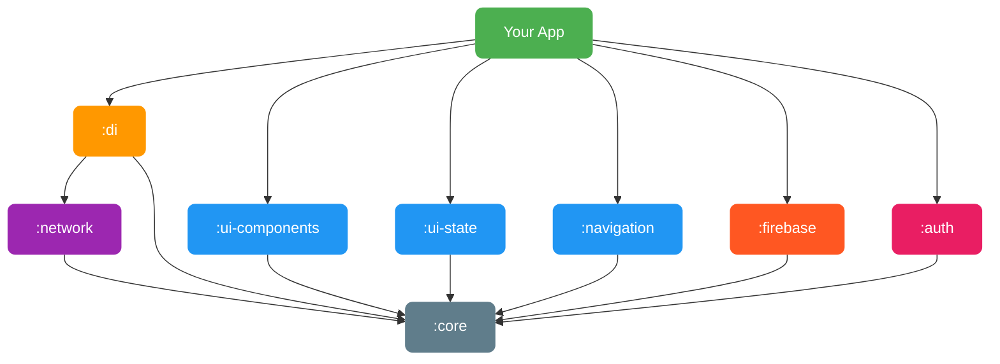
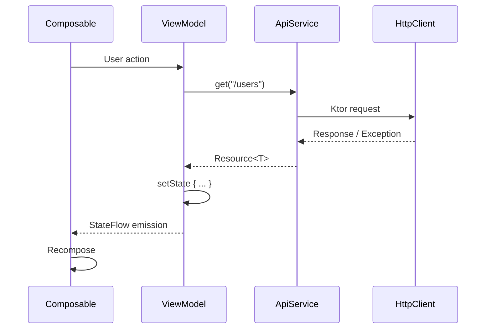

# Miru SDK

**Kotlin Multiplatform SDK for accelerating mobile development.**

Miru SDK provides a modular, configurable foundation for building Android and iOS apps with shared business logic and UI components. Designed as an internal base project for software houses, it handles networking, state management, navigation, theming, and dependency injection out of the box — so your team can focus on features, not boilerplate.

[](https://jitpack.io/#wahidabd/miru-sdk)

---

## Features

- **Multiplatform** — Single codebase targeting Android and iOS
- **Modular Architecture** — Pick only the modules you need
- **Type-Safe Networking** — Ktor-based HTTP client with automatic error mapping
- **State Management** — BaseViewModel + UiState pattern with one-time event support
- **Navigation** — Compose Navigation wrapper with safe navigation, transitions, and result passing
- **UI Components** — Ready-to-use Material 3 composables with full theming
- **Dependency Injection** — Koin-powered DI with Compose integration
- **Firebase** — Remote Config + FCM topic management with KMP support
- **Social Auth** — Google, Apple, Facebook OAuth with pre-built sign-in buttons
- **Configurable** — Override themes, API configs, and inject custom modules per project

---

## Architecture

```
┌───────────────────────────────────────────────────────────────────┐
│                            Your App                               │
├─────────────┬──────────┬──────────┬──────────┬────────┬──────────┤
│ ui-components│ ui-state │navigation│ firebase │  auth  │    di    │
├─────────────┴──────────┴──────────┴──────────┴────────┤          │
│                       network                         │          │
├───────────────────────────────────────────────────────┤          │
│                        core                           │          │
└───────────────────────────────────────────────────────┴──────────┘
```

### Module Dependency Graph



### Data Flow



---

## Modules

| Module | Description |
|---|---|
| **`:core`** | Base utilities — `Resource<T>`, `AppException`, `Mapper`, extensions, logging |
| **`:network`** | HTTP client — `ApiService`, `safeApiCall`, token management, error handling |
| **`:ui-state`** | State management — `BaseViewModel`, `UiState`, `MutableEventFlow`, pagination |
| **`:navigation`** | Navigation — `NavigationManager`, safe navigation, transitions, result passing |
| **`:ui-components`** | UI library — Buttons, TextFields, Dialogs, TopBar, BottomSheet, Theming |
| **`:firebase`** | Firebase KMP — Remote Config, FCM topic subscribe/unsubscribe, TopicManager |
| **`:auth`** | Social Auth — Google, Apple, Facebook OAuth with pre-built Compose sign-in buttons |
| **`:di`** | DI & init — `MiruSdkInitializer`, Koin modules, Compose injection helpers |

---

## Tech Stack

| Technology | Version | Purpose |
|---|---|---|
| Kotlin | 2.3.0 | Language |
| Compose Multiplatform | 1.10.0 | Shared UI |
| Ktor | 3.4.1 | HTTP Client |
| Koin | 4.0.3 | Dependency Injection |
| Kotlinx Serialization | 1.7.3 | JSON parsing |
| Kotlinx Coroutines | 1.9.0 | Async programming |
| Firebase KMP (GitLive) | 2.1.0 | Remote Config, FCM |
| KMPAuth | 2.5.0-alpha01 | Google, Apple, Facebook OAuth |
| Coil | 3.0.4 | Image loading |
| Napier | 2.7.1 | Multiplatform logging |
| AGP | 9.0.0 | Android build |

---

## Installation

Add JitPack repository to your `settings.gradle.kts`:

```kotlin
dependencyResolutionManagement {
    repositories {
        google()
        mavenCentral()
        maven("https://jitpack.io")
    }
}
```

Add dependencies in your module's `build.gradle.kts`:

```kotlin
dependencies {
    // All modules
    implementation("com.github.wahidabd.miru-sdk:core:<version>")
    implementation("com.github.wahidabd.miru-sdk:network:<version>")
    implementation("com.github.wahidabd.miru-sdk:ui-state:<version>")
    implementation("com.github.wahidabd.miru-sdk:navigation:<version>")
    implementation("com.github.wahidabd.miru-sdk:ui-components:<version>")
    implementation("com.github.wahidabd.miru-sdk:firebase:<version>")
    implementation("com.github.wahidabd.miru-sdk:auth:<version>")
    implementation("com.github.wahidabd.miru-sdk:di:<version>")
}
```

> Replace `<version>` with the latest release tag.

---

## Quick Start

### 1. Initialize the SDK

```kotlin
// Application.kt or shared entry point
MiruSdkInitializer.initialize(
    MiruSdkConfig(
        networkConfig = NetworkConfig(
            baseUrl = "https://api.yourapp.com/v1/",
            enableLogging = BuildConfig.DEBUG
        ),
        enableLogging = true,
        tokenProvider = MyTokenProvider(),     // optional
        additionalModules = listOf(appModule) // your Koin modules
    )
)
```

### 2. Create an API Service

```kotlin
class UserApi(httpClient: HttpClient) : ApiService(httpClient) {

    suspend fun getUsers(): Resource<ApiResponse<List<User>>> =
        get("users")

    suspend fun getUserById(id: Int): Resource<ApiResponse<User>> =
        get("users/$id")

    suspend fun createUser(body: CreateUserRequest): Resource<ApiResponse<User>> =
        post("users", body = body)
}
```

### 3. Create a ViewModel

```kotlin
data class UserListState(
    val users: List<User> = emptyList(),
    val isLoading: Boolean = false,
    val error: String? = null
)

sealed interface UserListEvent {
    data class ShowError(val message: String) : UserListEvent
}

class UserListViewModel(
    private val userApi: UserApi
) : BaseViewModel<UserListState, UserListEvent>(UserListState()) {

    fun loadUsers() = launch {
        setState { copy(isLoading = true, error = null) }

        userApi.getUsers()
            .onSuccess { response ->
                setState { copy(users = response.data.orEmpty(), isLoading = false) }
            }
            .onError { exception, _ ->
                setState { copy(isLoading = false, error = exception.message) }
                sendEvent(UserListEvent.ShowError(exception.message ?: "Unknown error"))
            }
    }
}
```

### 4. Build the UI

```kotlin
@Composable
fun UserListScreen(viewModel: UserListViewModel = koinViewModel()) {
    val state by viewModel.uiState.collectAsStateLifecycleAware()

    // Handle one-time events
    viewModel.events.collectAsEffect { event ->
        when (event) {
            is UserListEvent.ShowError -> { /* show snackbar */ }
        }
    }

    MiruTheme {
        when {
            state.isLoading -> MiruFullScreenLoading()
            state.error != null -> MiruErrorView(
                message = state.error!!,
                onRetry = { viewModel.loadUsers() }
            )
            else -> LazyColumn {
                items(state.users) { user ->
                    MiruCard {
                        Text(user.name, style = MiruTheme.typography.titleMedium)
                    }
                }
            }
        }
    }
}
```

### 5. Set Up Navigation

```kotlin
@Composable
fun AppNavigation() {
    val navigationManager = remember { NavigationManagerImpl() }

    MiruNavigationHost(startDestination = "home") {
        composable("home") { HomeScreen() }
        composable("users") { UserListScreen() }
        composable("user/{id}") { backStackEntry ->
            val id = backStackEntry.getIntArgument("id")
            UserDetailScreen(userId = id)
        }
    }
}
```

---

## Module Details

### Core

The foundation layer with zero UI dependencies.

**Resource** wraps all async operations:

```kotlin
val result: Resource<User> = userApi.getUserById(1)

result
    .onSuccess { user -> println(user.name) }
    .onError { exception, _ -> println(exception.message) }
    .onLoading { println("Loading...") }
```

**AppException** provides typed error handling:

```kotlin
when (exception) {
    is AppException.UnauthorizedException -> navigateToLogin()
    is AppException.NetworkException -> showOfflineMessage()
    is AppException.ServerException -> showServerError(exception.code)
    is AppException.TimeoutException -> showRetryDialog()
    else -> showGenericError()
}
```

**Extensions** for common operations:

```kotlin
// String
"hello world".capitalizeFirst()   // "Hello world"
"test@email.com".isValidEmail()   // true

// Flow
flow.throttleFirst(300L)
flow.retryWithExponentialBackoff(maxRetries = 3)
flow.asResource() // Flow<T> -> Flow<Resource<T>>

// Collections
list.safeGet(99)                    // null instead of crash
list.updateIf({ it.id == 5 }) { it.copy(name = "Updated") }
```

### Network

**Token management** with automatic event broadcasting:

```kotlin
class MyTokenProvider : TokenProvider {
    override suspend fun getAccessToken(): String? = prefs.getString("access_token")
    override suspend fun getRefreshToken(): String? = prefs.getString("refresh_token")
    override suspend fun saveTokens(accessToken: String, refreshToken: String) { /* save */ }
    override suspend fun clearTokens() { /* clear */ }
    override suspend fun isLoggedIn(): Boolean = getAccessToken() != null
}

// Listen for token events globally
TokenEventBus.events.collect { event ->
    when (event) {
        TokenEvent.ForceLogout -> navigateToLogin()
        TokenEvent.TokenExpired -> refreshToken()
        TokenEvent.TokenRefreshed -> retryRequest()
    }
}
```

### UI State

**BaseViewModel** with built-in patterns:

```kotlin
class ProductViewModel(
    private val api: ProductApi
) : BaseViewModel<ProductState, ProductEvent>(ProductState()) {

    // Automatic Resource collection
    fun loadProducts() {
        api.getProducts().asFlow()
            .collectResource(
                onLoading = { setState { copy(isLoading = true) } },
                onSuccess = { data -> setState { copy(products = data, isLoading = false) } },
                onError = { e -> setState { copy(error = e.message, isLoading = false) } }
            )
    }
}
```

**PagingState** for list pagination:

```kotlin
data class FeedState(
    val paging: PagingState<Post> = PagingState()
)

// Append new page
setState { copy(paging = paging.appendItems(newPosts)) }

// Refresh
setState { copy(paging = paging.refresh(freshPosts)) }
```

### UI Components

**Theming** — customize per project:

```kotlin
MiruTheme(
    colorScheme = MiruColorScheme(
        primary = Color(0xFF1E88E5),
        secondary = Color(0xFFFF6F00),
        // ... your brand colors
    ),
    typography = MiruTypography(
        titleLarge = TextStyle(fontSize = 22.sp, fontWeight = FontWeight.Bold),
        // ... your typography
    )
) {
    // All Miru components inherit these values
    MiruButton(text = "Submit", onClick = { })
}
```

**Available components:**

```
MiruButton          MiruTextField       MiruPasswordField
MiruSearchField     MiruTopBar          MiruSearchTopBar
MiruBottomSheet     MiruCard            MiruInfoCard
MiruAlertDialog     MiruLoadingDialog   MiruConfirmationDialog
MiruErrorView       MiruEmptyView       MiruFullScreenLoading
MiruLoadingIndicator MiruShimmerEffect  MiruNetworkImage
MiruSpacer          MiruVerticalSpacer  MiruHorizontalSpacer
```

### Firebase

**Remote Config** — fetch and read config values:

```kotlin
val config: MiruRemoteConfig = get() // via Koin

// Set defaults before fetching
config.setDefaults(mapOf(
    "feature_new_ui" to false,
    "api_base_url" to "https://api.yourapp.com",
    "max_retry" to 3L
))

// Fetch & activate
config.fetchAndActivate().collect { resource ->
    resource.onSuccess { activated -> println("Config activated: $activated") }
}

// Read values
val featureEnabled = config.getBoolean("feature_new_ui")
val apiUrl = config.getString("api_base_url")
val maxRetry = config.getLong("max_retry")
```

**FCM Topic Management** — subscribe/unsubscribe with reactive state tracking:

```kotlin
val topicManager: TopicManager = get() // via Koin

// Subscribe to topics
topicManager.subscribe("promo")
topicManager.subscribeAll(listOf("news", "updates", "alerts"))

// Observe active subscriptions reactively
topicManager.subscribedTopics.collect { topics ->
    println("Subscribed to: $topics")
}

// Check & unsubscribe
if (topicManager.isSubscribed("promo")) {
    topicManager.unsubscribe("promo")
}
```

**Koin setup:**

```kotlin
startKoin {
    modules(
        firebaseModule, // provides MiruRemoteConfig, MiruMessaging, TopicManager
        // ... other modules
    )
}
```

### Auth

**Google Sign-In** — standalone One Tap, dapet `idToken` langsung (no Firebase):

```kotlin
// 1. Initialize once at app startup
MiruGoogleAuth.initialize(serverClientId = "YOUR_SERVER_CLIENT_ID")

// 2. Pre-built Compose button
MiruGoogleSignInButton { resource ->
    resource.onSuccess { auth ->
        // Send idToken to your backend API
        api.loginWithGoogle(auth.idToken!!)
    }
}
```

**Apple Sign-In** — native iOS only, returns `identityToken`:

```kotlin
val appleAuth: MiruAppleAuth = get()

if (appleAuth.isAvailable()) {
    val result = appleAuth.signIn() // shows native Apple popup
    result?.let { auth ->
        // auth.idToken = Apple identityToken
        // auth.email, auth.displayName
        api.loginWithApple(auth.idToken!!)
    }
}
```

**Facebook Login** — native SDK, returns `accessToken`:

```kotlin
// Android: set ActivityResultRegistryOwner before sign-in (in your Activity's onCreate)
MiruFacebookAuth.setActivityResultRegistryOwner(this)

val facebookAuth: MiruFacebookAuth = get()

val result = facebookAuth.signIn() // shows Facebook login popup
result?.let { auth ->
    // auth.accessToken = Facebook access token
    // auth.email, auth.displayName, auth.photoUrl
    api.loginWithFacebook(auth.accessToken!!)
}

// Android: clear in onDestroy to prevent leaks
MiruFacebookAuth.clearActivityResultRegistryOwner()
```

**MiruAuthManager** — centralized auth state (provider-agnostic):

```kotlin
val authManager: MiruAuthManager = get()

// Observe auth state reactively
authManager.currentUser.collect { user ->
    if (user != null) navigateToHome()
    else navigateToLogin()
}

// Handle any sign-in result
MiruGoogleSignInButton { resource ->
    authManager.handleSignInResult(resource)
}

// Sign out
authManager.signOut()
```

| Provider | Platform | Implementation |
|---|---|---|
| Google | Android + iOS | KMPAuth standalone (commonMain) |
| Apple | iOS only | Native ASAuthorization (iosMain) |
| Facebook | Android + iOS | Facebook SDK (expect/actual) |

---

## Project Structure

```
miru-sdk/
├── core/                          # Base utilities
│   └── src/commonMain/kotlin/
│       └── com/miru/sdk/core/
│           ├── AppException.kt
│           ├── Resource.kt
│           ├── dispatcher/
│           ├── ext/               # String, Flow, Collection, DateTime extensions
│           ├── logger/
│           └── mapper/
├── network/                       # HTTP layer
│   └── src/commonMain/kotlin/
│       └── com/miru/sdk/network/
│           ├── ApiService.kt
│           ├── SafeApiCall.kt
│           ├── client/            # HttpClientFactory, HttpEngineFactory
│           ├── config/            # NetworkConfig
│           ├── model/             # ApiResponse, ErrorResponse
│           └── token/             # TokenProvider, TokenEvent
├── ui-state/                      # State management
│   └── src/commonMain/kotlin/
│       └── com/miru/sdk/ui/state/
│           ├── BaseViewModel.kt
│           ├── UiState.kt
│           ├── UiEvent.kt
│           ├── EventFlow.kt
│           ├── PagingState.kt
│           └── StateExtensions.kt
├── navigation/                    # Navigation
│   └── src/commonMain/kotlin/
│       └── com/miru/sdk/navigation/
│           ├── MiruNavHost.kt
│           ├── NavigationManager.kt
│           ├── NavigationExt.kt
│           ├── result/
│           └── transition/
├── ui-components/                 # Composables
│   └── src/commonMain/kotlin/
│       └── com/miru/sdk/ui/components/
│           ├── theme/             # MiruTheme, colors, typography
│           ├── button/
│           ├── textfield/
│           ├── topbar/
│           ├── bottomsheet/
│           ├── card/
│           ├── dialog/
│           ├── error/
│           ├── image/
│           ├── loading/
│           └── spacer/
├── auth/                          # Social Auth (OAuth)
│   └── src/commonMain/kotlin/
│       └── com/miru/sdk/auth/
│           ├── AuthModule.kt
│           ├── AuthResult.kt
│           ├── AuthException.kt
│           ├── MiruAuthManager.kt
│           ├── google/            # MiruGoogleAuth
│           ├── apple/             # MiruAppleAuth
│           ├── facebook/          # MiruFacebookAuth
│           └── ui/                # Pre-built sign-in buttons
├── firebase/                      # Firebase KMP
│   └── src/commonMain/kotlin/
│       └── com/miru/sdk/firebase/
│           ├── FirebaseModule.kt
│           ├── config/            # MiruRemoteConfig
│           └── messaging/         # MiruMessaging, TopicManager
├── di/                            # Dependency injection
│   └── src/commonMain/kotlin/
│       └── com/miru/sdk/di/
│           ├── MiruSdkInitializer.kt
│           ├── KoinExt.kt
│           └── modules/
├── gradle/
│   └── libs.versions.toml        # Version catalog
├── build.gradle.kts
├── settings.gradle.kts
└── jitpack.yml
```

---

## Requirements

- Kotlin 2.3.0+
- Android: minSdk 24, compileSdk 35
- iOS: iosX64, iosArm64, iosSimulatorArm64
- Gradle 9.1+
- JDK 21+

---

## License

```
MIT License

Copyright (c) 2026 wahidabd

Permission is hereby granted, free of charge, to any person obtaining a copy
of this software and associated documentation files (the "Software"), to deal
in the Software without restriction, including without limitation the rights
to use, copy, modify, merge, publish, distribute, sublicense, and/or sell
copies of the Software, and to permit persons to whom the Software is
furnished to do so, subject to the following conditions:

The above copyright notice and this permission notice shall be included in all
copies or substantial portions of the Software.

THE SOFTWARE IS PROVIDED "AS IS", WITHOUT WARRANTY OF ANY KIND, EXPRESS OR
IMPLIED, INCLUDING BUT NOT LIMITED TO THE WARRANTIES OF MERCHANTABILITY,
FITNESS FOR A PARTICULAR PURPOSE AND NONINFRINGEMENT. IN NO EVENT SHALL THE
AUTHORS OR COPYRIGHT HOLDERS BE LIABLE FOR ANY CLAIM, DAMAGES OR OTHER
LIABILITY, WHETHER IN AN ACTION OF CONTRACT, TORT OR OTHERWISE, ARISING FROM,
OUT OF OR IN CONNECTION WITH THE SOFTWARE OR THE USE OR OTHER DEALINGS IN THE
SOFTWARE.
```
