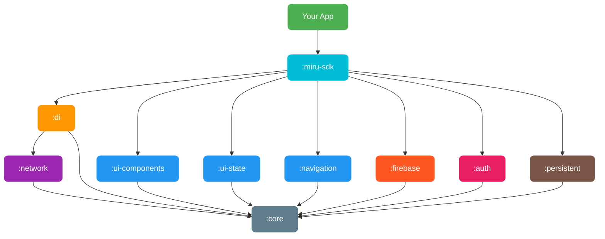
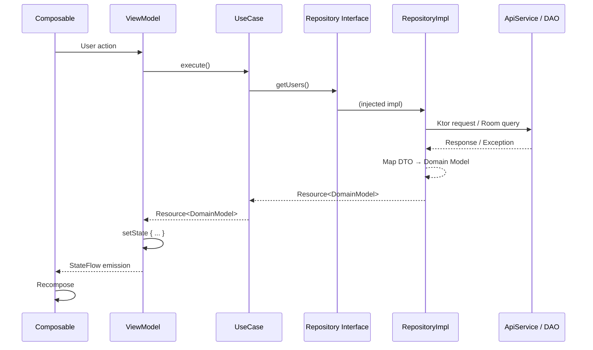

# Architecture

## Clean Architecture Per Module

Each module follows Clean Architecture with three layers:

```
┌──────────────────────────────────────────────┐
│              Presentation Layer               │
│  (UI Composables, ViewModels, UiState)        │
│                     │                         │
│                     ▼                         │
│               Domain Layer                    │
│  (Use Cases, Repository Interfaces, Models)   │
│                     │                         │
│                     ▼                         │
│                Data Layer                     │
│  (Repository Impl, API, DAO, DataSource)      │
└──────────────────────────────────────────────┘
```

The dependency rule flows **inward only**: `presentation → domain ← data`. Domain never depends on data or presentation.

- **Domain** is the innermost layer — defines interfaces (repository contracts) and business models with zero external dependencies.
- **Data** implements domain interfaces with concrete data sources (API, Room, DataStore).
- **Presentation** consumes domain use cases and exposes UI state.

## Module Dependency Graph



The `:miru-sdk` umbrella module uses `api()` dependencies so everything is transitively available to your app with a single import.

## Data Flow



## Internal Module Structure

Each feature module follows this folder pattern:

```
:feature-module/
└── src/commonMain/kotlin/
    └── com/miru/sdk/feature/
        ├── data/                  # Data Layer
        │   ├── repository/        #   Repository implementations
        │   ├── source/            #   Remote/Local data sources
        │   ├── model/             #   DTOs, entities, API models
        │   └── mapper/            #   Data ↔ Domain mappers
        ├── domain/                # Domain Layer
        │   ├── repository/        #   Repository interfaces (contracts)
        │   ├── model/             #   Business/domain models
        │   └── usecase/           #   Use cases (business logic)
        └── presentation/          # Presentation Layer (if applicable)
            ├── ui/                #   Composable screens/components
            └── viewmodel/         #   ViewModels + UiState
```

:::note
Not all modules have all three layers. Foundation modules like `:core` and `:network` primarily provide domain and data abstractions. UI-only modules like `:ui-components` are purely presentation.
:::

## Layer Mapping Summary

| Module | Domain | Data | Presentation |
|---|---|---|---|
| `:core` | Resource, AppException, Mapper, Extensions | Logger, DispatcherProvider | — |
| `:network` | TokenProvider, TokenEvent | ApiService, SafeApiCall, HttpClient | — |
| `:ui-state` | — | — | BaseViewModel, UiState, EventFlow |
| `:navigation` | NavigationManager, NavigationResult | — | MiruNavHost, Transitions |
| `:ui-components` | — | — | Theme, Buttons, Cards, Dialogs |
| `:auth` | AuthResult, MiruAuthManager | Google/Apple/Facebook Auth | Sign-in buttons |
| `:firebase` | RemoteConfig/Messaging interfaces | Firebase impl, TopicManager | — |
| `:persistent` | Preferences/Database interfaces | Room, DataStore | — |
| `:di` | — | Koin module wiring | — |
